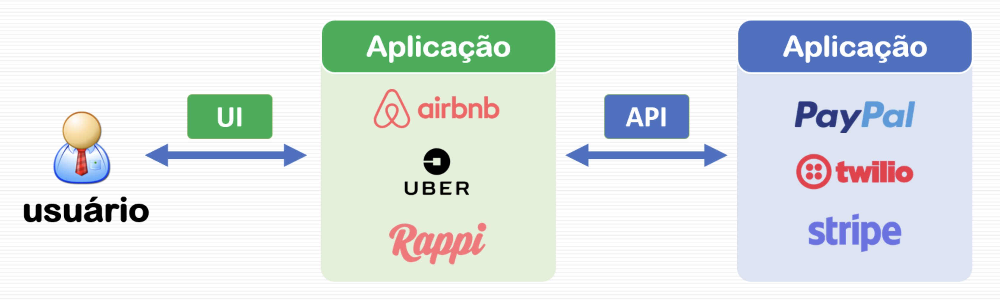
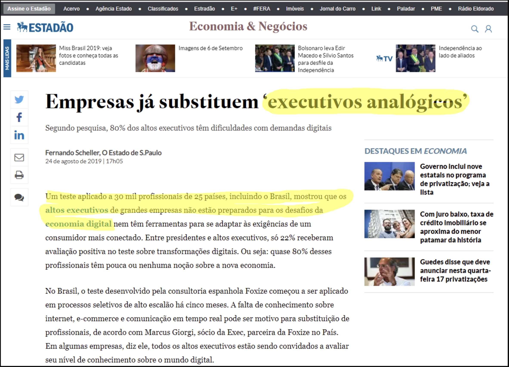

Até pouco tempo, eu provocava os alunos com a seguinte questão: "... se você não sabe falar inglês ainda, comece ontem. Se você não tem dinheiro para pagar por um curso de inglês, baixe o [Duolingo](https://pt.duolingo.com/) agora e comece já". A provocação de hoje é outra e vale para todas as pessoas e não apenas para os universitários da área de tecnologia: "Se você não sabe programar, comece a aprender desde já".

Para quem ainda pensa que o fenômeno da transformação digital acontece nas organizações apenas com implantação de um ERP (Sistemas de Gestão Corporativa), a montagem de dashboards de *Business Intelligence* ou a aplicação de algumas técnicas de Ciência de Dados, [vale a pena ler um pouco sobre essa revolução](https://techcrunch.com/2019/09/06/apis-are-the-next-big-saas-wave/) que, para muitos, é silenciosa. A mudança afeta a forma como as organizações devem se estruturar, muda quem é o seu real cliente e, também, altera a maneira de como os seus produtos e serviços são, efetivamente, faturados. Em outras palavras, o seu modelo de negócios é bem diferente do que temos visto até hoje.

Um exemplo disso está nas empresas que faturam muito com nossas transações do dia a dia, sem sequer conhecermos seus nomes, por meio de um conjunto de serviços oferecidos na forma de APIs. API é o acrônimo para *Application Programming Interfaces*, ou a interface por meio da qual uma aplicação como o AirBnb se integra com o Facebook para te permitir um login mais rápido ou com o PayPal para confirmar sua reserva. Em outras palavras, API é a forma como um determinado software/aplicação "conversa" com outro software/aplicação. Há bastante tempo, as mais diversas redes sociais oferecem APIs para permitir que usuários possam utilizar outros aplicativos para facilitar o processo de interação com seus contatos.

A figura a seguir apresenta a diferença entre a User Interface (UI) ou interface da aplicação com o usuário e a API que acontece entre aplicações.

Diferença entre User Interface (UI) e Application Programming Interface (API)
A novidade se dá por conta de empresas desconhecidas para a maioria das pessoas que estão faturando alto com a movimentação dessas mesmas pessoas em negócios como Uber, AirBnB, e tantos outros em seus smartphones. Uma parte das engrenagens dos aplicativos que efetuam pedidos de corrida ou reservas de acomodações pelo mundo são o negócio de empresas como [Stripe](https://stripe.com/), [Checkr](https://checkr.com/), [Twilio](https://www.twilio.com/), [Plaid](https://plaid.com/) que já passaram da fase de Unicórnio e estão fazendo a festa de investidores que já compreenderam em quais bits está o futuro.

Diferentemente das empresas tradicionais, que disputam a nossa atenção no mundo real, estas outras empresas atuam como retaguarda das empresas que conhecemos, oferecendo um cardápio que está disponível apenas no mundo digital. A Stripe se encarrega de facilitar a realização de pagamentos online. A Checkr realiza verificação integrada do número de seguro social (o nosso CPF aqui no Brasil) ou a existência de registros criminais. A Twillio simplifica a comunicação de empresas com seus clientes por meio de Whatsapp, SMSs e e-mails oferecendo um verdadeiro serviço de contact center via APIs. A Plaid também se encarrega de facilitar a integração com instituições financeiras. Enfim, esse é o contexto da tão falada transformação digital.

No Brasil, startups e grandes corporações vão aderindo ao Mundo API, algumas de forma mais rápida e outras em ritmo mais lento. A startup mineira, Sympla, [anunciou recentemente a liberação da sua API pública](https://blog.sympla.com.br/sympla-disponibiliza-api-publica/) permitindo que produtores de eventos automatizem alguns dos seus processos de forma simplificada. O Banco do Brasil, em parceria com a startup BxBlue, [lançou no ano passado uma API para operações de crédito](https://startupi.com.br/2018/09/banco-do-brasil-e-startup-lancam-api-de-credito/). Na esfera governamental, O [Serpro atualizou no meio do ano passado sua API](http://www.serpro.gov.br/menu/noticias/noticias-2018/nova-api-serpro-facilita-a-vida-de-instituicoes-financeiras-que-operam-no-mercado-de-cambio) simplificando o trâmite documental do comércio exterior, mas já permitia a qualquer pessoa acessar, com segurança, informações do CPF/CNPJ, além de outras. Em Belo Horizonte, a Prodabel disponibiliza um conjunto de APIs para o seu [sistema de Geoprocessamento](https://bhgeo.pbh.gov.br/home) e para integração ao [Rotativo Digital](https://prefeitura.pbh.gov.br/bhtrans/rotativo/sobre) da BHTrans, expandindo seus investimentos em Smart Cities.

Em um [artigo da TechCrunch](https://techcrunch.com/2019/09/06/apis-are-the-next-big-saas-wave/) desta semana, Daniel Levine - Partner na empresa de investimentos [Accel](https://www.accel.com/) -, fala sobre a revolução das APIs, colocando as interfaces de programação como a grande onda do software ofertado como serviço (SaaS) para os próximos anos. Esse fenômeno explica porque a [evolução das ações do Magazine Luiza](https://www.infomoney.com.br/magazineluiza/noticia/7557122/magazine-luiza-segredo-empresa-que-subiu-467-bolsa) se assemelha com uma curva exponencial e porque a empresa teve que [fazer recentemente um desdobramento de 1 para 8](https://www.infomoney.com.br/magazineluiza/noticia/8527987/magazine-luiza-propoe-desdobramento-de-acoes-na-proporcao-de-1-para-8) depois de terem atingido a marca de R$ 230,00

Bem, mas voltando à provocação inicial sobre a necessidade de que todos devam aprender a programar, isso parte de uma preocupação que compartilho aqui ao perceber a dificuldade atual por que passa diversas organizações em preencher posições de trabalho que estão mirando no mundo digital, que já está a nossa volta. Na área de tecnologia, já podemos considerar que estamos chegando a um certo colapso estrutural pela baixa disponibilidade de profissionais com experiência em tecnologias como as que citei acima. Diante disso, [algumas análises já mostram o aumento no valor dos salários destes profissionais](https://www.techrepublic.com/article/developer-pay-heres-how-salaries-rise-with-experience-across-programming-languages/).

> Uma nova análise mostra que os salários dos desenvolvedores tendem a subir constantemente por pelo menos 20 anos, aumentando para mais de US $ 100.000 em remuneração anual.
> [Tech Republic](https://www.techrepublic.com/article/developer-pay-heres-how-salaries-rise-with-experience-across-programming-languages/) (ago/2019)

Isso está refletindo não apenas em profissionais específicos da área de Tecnologia da Informação e Comunicação (TIC), mas, também, na escolha de pessoas para outras posições como é o caso dos executivos C-level como os CEOs, CFOs, CIOs, etc. Num artigo publicado (e depois removido) no Estadão, as empresas já estão buscando trocar os seus executivos analógicos. Fiz questão de resgatar o artigo que eu tinha visto, utilizando o [cache do Google](https://webcache.googleusercontent.com/search?q=cache:jlJhfsAIHWsJ:https://economia.estadao.com.br/noticias/geral,empresas-ja-substituem-executivos-analogicos,70002980756+&cd=3&hl=pt-BR&ct=clnk&gl=br). Coloco a imagem a seguir.

Com a evolução das tecnologias envolvidas na transformação digital, a demanda pelos profissionais da área de TIC é evidente. Entretanto, em breve nos veremos, em todas as áreas, integrando nossas planilhas e apresentações, além dos sistemas utilizados nas nossas empresas e no nosso cotidiano com dados e informações em tempo real, disponíveis nas mais diversas plataformas da Internet. Isso vai exigir conhecimentos novos e que passam pelo caminho do aprendizado da programação de computadores. Não é a toa que existem diversos movimentos mundo afora voltados para o ensino da ciência da computação nas escolas de nível fundamental. É o caso do projeto [Code.org](https://code.org/) que promove ações de inclusão da ciência da computação em escolas e em comunidades menos privilegiadas.

> Todos neste país devem aprender como programar um computador... porque isso ensina você a como pensar.
> Steve Jobs

Os números de oportunidades abertas na área de TI variam, mas sempre vejo matérias que impressionam:

* [Falta de profissional de TI deixa 25 mil vagas abertas no mercado de trabalho](https://www.hojeemdia.com.br/horizontes/falta-de-profissional-de-ti-deixa-25-mil-vagas-abertas-no-mercado-de-trabalho-1.733640) (Hoje em dia - agosto/2019)
* [Mercado tem mais de 700 vagas para profissionais da tecnologia](https://www.em.com.br/app/noticia/emprego/2019/05/30/interna_emprego,1057854/mercado-tem-mais-de-700-vagas-para-profissionais-da-tecnologia.shtml) (Estado de Minas - maio/2019)
* [Setor prevê abir 420 mil empregos até 2024 e tem falta de mão de obra](https://economia.estadao.com.br/noticias/geral,esta-interessado-nas-vagas-do-setor-de-tecnologia-veja-como-se-preparar,70002816080) (Estadão - maio/2019) - paywall
* [Brasil tem 460 mil vagas em TI abertas, mas faltam profissionais qualificados](https://itmidia.com/brasil-tem-460-mil-vagas-em-ti-abertas-mas-faltam-profissionais-qualificados/) (ITMídia - julho/2018)

Assim sendo, ainda que você não veja dessa forma, convido para uma discussão sobre esse tema ou, no mínimo, uma reflexão para ajudarmos o Brasil a caminhar com o resto do mundo e não ficarmos para trás nessa onda de "transformação desenfreada" que está atropelando a todos por onde passa.
